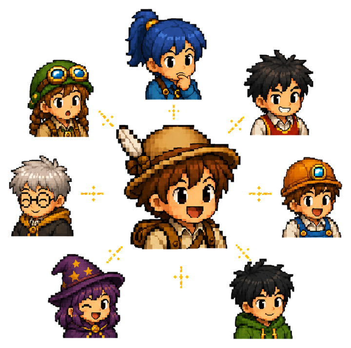
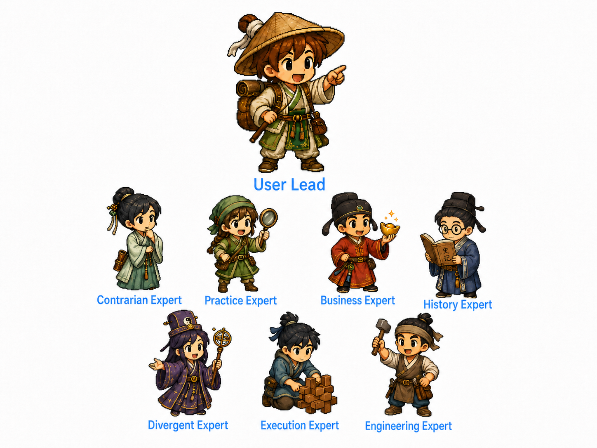

<p align="center">
  
</p>

<h1 align="center">Roundtable Skill</h1>

<p align="center">
  <strong>Your AI expert roundtable.</strong>
</p>

<p align="center">
  Turn one model's answer into a task-specific panel of Lingtai agents that
  challenges plans, maps blind spots, and keeps one Executor accountable for delivery.
</p>

<p align="center">
  <a href="README.zh-CN.md">中文</a> · English
</p>

<p align="center">
  <a href="https://github.com/rawpaper123/Roundtable-skill/stargazers"></a>
  <a href="https://github.com/rawpaper123/Roundtable-skill/actions/workflows/docs.yml"></a>
  <a href="LICENSE"></a>
  <a href="https://github.com/LingTai-AI/lingtai"></a>
  <a href="docs/EXECUTOR_SETUP.md"></a>
  <a href="skills/codex/roundtable-skill/SKILL.md"></a>
</p>

Roundtable Skill turns a single-agent task into a small expert meeting.
The Executor assigns temporary expert roles to available Lingtai agents, collects their reviews, maps disagreements, then decides what to do next.

It works best when one model thinking alone is too narrow: release gates, research briefs, strategy decisions, business plans, product reviews, and other work where missing one angle can change the answer.



**First time here? Start with the [Quickstart](QUICKSTART.md) 60-second fit check.**

## What It Does

- 🪑 **Runs a real roundtable**: each Lingtai agent gets a temporary expert role for this task only.
- 🔍 **Finds blind spots**: agents review the first plan, the evidence, and the Executor's progress from different angles.
- ⚖️ **Maps disagreement**: conflicting claims, weak evidence, and missing perspectives are made explicit.
- ✅ **Keeps one owner**: the Executor still owns the final decision, implementation, verification, Git state, and rollback when code is involved.
- 🧯 **Handles silent agents**: no infinite waiting; record the non-response, try one safe repair, then continue with evidence.

## Why It Exists

A single agent can sound confident while missing the point.

Roundtable adds structured disagreement. A practitioner may catch what the paper ignores. A skeptic may find the strongest counterexample. A security reviewer may block a risky merge. A finance voice may notice incentives that the product voice missed.

The roles are not permanent identities. They are assigned for the current task and discarded when the task ends.

The same roster can be reshuffled for every problem: one agent may be a skeptic
for a research brief, a release reviewer for a deploy gate, and a customer voice
for a business plan. The value comes from choosing useful tension, not from
locking agents into permanent personas.

The point is not "more agents." The point is the right tension: different roles
pull on the same problem until weak assumptions, missing evidence, and useful
next steps become visible.

## Tech Stack

- Markdown docs and prompt templates
- Codex skill package under `skills/codex/roundtable-skill`
- PowerShell and Bash install/readiness scripts
- Lingtai as the required external agent runtime
- GitHub Actions docs validation

This repo does not bundle Lingtai and does not claim real multi-agent execution without Lingtai configured.

## Quickstart

Use one command to fetch the Roundtable pack and choose the right Executor
path. Codex gets a native skill install when available; other coding agents use
the same Roundtable protocol prompt and Lingtai readiness checks.

```powershell
$rt = Join-Path $env:TEMP "Roundtable-skill"; Remove-Item -Recurse -Force $rt -ErrorAction SilentlyContinue; git clone --depth 1 https://github.com/rawpaper123/Roundtable-skill.git $rt; & "$rt\scripts\install-roundtable.ps1"
```

```bash
tmp="$(mktemp -d)" && git clone --depth 1 https://github.com/rawpaper123/Roundtable-skill.git "$tmp/Roundtable-skill" && "$tmp/Roundtable-skill/scripts/install-roundtable.sh"
```

Then configure Lingtai in the target project and check readiness:

```powershell
.\scripts\check-roundtable.ps1 -RequireLingtai
```

```bash
./scripts/check-roundtable.sh --require-lingtai
```

If the check reports `docs_only`, do not fake expert replies. Configure Lingtai and at least one agent first.

There is no universal native "skill" format across all coding agents yet.
Roundtable therefore ships a native Codex installer plus an executor-neutral
protocol prompt for Claude Code, Cursor, Windsurf, Kimi Work, and other agents.
The important requirement is not Codex; it is a working Executor plus at least
one reachable Lingtai agent.

Full setup:

- [Quickstart](QUICKSTART.md)
- [Lingtai setup](docs/LINGTAI_SETUP.md)
- [Install matrix](docs/INSTALL_MATRIX.md)
- [First run checklist](docs/FIRST_RUN_CHECKLIST.md)
- [Troubleshooting](docs/TROUBLESHOOTING.md)

## Use Cases

Users do not need to hand-pick expert roles. The Executor reads the task,
chooses the smallest useful panel, asks for concerns or no-opinion, then owns
the final decision. The icons below mark common lead perspectives; the actual
panel is assigned per task.

<table>
  <tr>
    <td width="95"><br><strong>Development</strong></td>
    <td>Release gates, production bugs, migrations, and risky refactors.</td>
    <td>  Reliability, security, data integrity, rollback.</td>
  </tr>
  <tr>
    <td><br><strong>Research</strong></td>
    <td>Questions where evidence conflicts or one summary would be too narrow.</td>
    <td>  Practitioner, scholar, skeptic, incentives, history.</td>
  </tr>
  <tr>
    <td><br><strong>Business</strong></td>
    <td>Plans, launches, pricing, partnerships, and go-to-market choices.</td>
    <td>  Customer reality, operator cost, finance, legal/risk.</td>
  </tr>
  <tr>
    <td><br><strong>Daily</strong></td>
    <td>Personal decisions where reversibility, time, and tradeoffs matter.</td>
    <td>  Practical friend, budget/time, risk, contrarian.</td>
  </tr>
</table>

More patterns: [Use cases](docs/USE_CASES.md), [Showcase](docs/SHOWCASE.md), [Demo script](docs/DEMO_SCRIPT.md).

## Core Protocol

1. Executor inspects the task and current evidence.
2. Executor assigns temporary expert roles to available Lingtai agents.
3. Agents reply with must-fix issues, concerns, or `No opinion from my expert perspective.`
4. Executor maps conflicts and decides what advice to accept or reject.
5. Executor performs the work or produces the final brief.
6. Executor reports evidence, validation, remaining risk, and rollback when relevant.

## Good First Task

Use Roundtable first on a real but low-risk task:

- review a small PR before merge,
- pressure-test a research summary,
- review a launch checklist,
- critique a business plan,
- compare two product directions.

Do not use the first run for secrets, production data deletion, irreversible migrations, or high-stakes decisions without human review.

## Links

- [Why Roundtable?](docs/WHY_ROUNDTABLE.md)
- [Comparison](docs/COMPARISON.md)
- [Agent roster guide](docs/AGENT_ROSTER_GUIDE.md)
- [Executor setup](docs/EXECUTOR_SETUP.md)
- [Security](SECURITY.md)
- [Contributing](CONTRIBUTING.md)
- [Release notes](CHANGELOG.md)

Need help? Use [Discussions](https://github.com/rawpaper123/Roundtable-skill/discussions/1) or open a [setup help issue](https://github.com/rawpaper123/Roundtable-skill/issues/new?template=setup_help.md).

## Contributing

Good contributions make Roundtable easier to run in real projects: clearer setup paths, better executor adapters, safer examples, and sharper use-case prompts. Start with [CONTRIBUTING.md](CONTRIBUTING.md) or open an issue if a first run gets stuck.

## License

MIT
