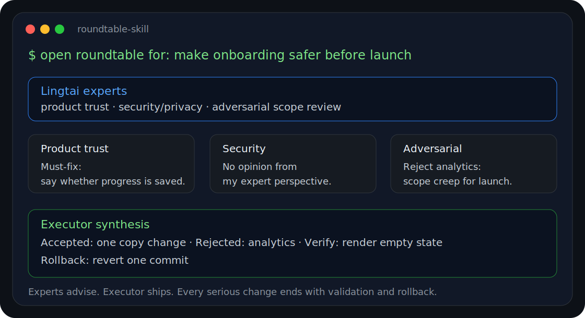

# Roundtable Skill 🪑

[中文](README.zh-CN.md) | English

Bring an expert panel into your coding terminal.



**New here? Start with [QUICKSTART.md](QUICKSTART.md).**

[Install](#install-as-a-codex-skill) · [Quickstart](QUICKSTART.md) ·
[Demo](examples/sanitized-roundtable-run.md) ·
[Why Roundtable?](docs/WHY_ROUNDTABLE.md) ·
[Release notes](CHANGELOG.md) · [Contributing](CONTRIBUTING.md)

Roundtable Skill is an executor-neutral workflow for turning one coding agent
into a disciplined **planner + reviewer + executor loop**. It helps your current
coding terminal ask the right experts, reject vague advice, implement the
smallest safe change, and ship with verification.

The current coding terminal is the **Executor**. It can be Codex, Claude Code,
Kimi Work, Cursor, Windsurf, or another agentic terminal. The Executor owns the
final implementation, verification, Git state, pull request, deployment, and
rollback. Roundtable agents advise; they do not override the user or the
Executor.

Roundtable Skill is built on
[Lingtai](https://github.com/LingTai-AI/lingtai) as the agent runtime. This
repository does not bundle Lingtai. Without Lingtai configured, this repository
only provides readable docs and templates; it cannot run a working multi-agent
Roundtable.

## Why Use It?

Most agentic coding failures are not syntax failures. They are coordination
failures:

- the planner expands scope,
- the reviewer invents concerns,
- the executor ships without verifying production reality,
- one silent agent blocks the whole loop,
- nobody owns rollback.

Roundtable Skill fixes that with a small protocol:

- 🧭 **Dynamic expert roles** - pick the right reviewers for this task, not fixed personas forever.
- 🧑‍⚖️ **Executor as final arbiter** - experts advise, your coding terminal decides and ships.
- ✅ **No-opinion rule** - experts can say "no concerns" instead of inventing work.
- ⏱️ **Bounded waiting** - no infinite agent loops.
- 🛠️ **Repair silent agents once** - check delivery/liveness, wake once, then continue.
- 🔒 **No secrets by design** - runtime state and tokens stay out of the repo.
- 🔁 **Rollback-first delivery** - every serious change ends with validation and rollback.

## Why Switch From A Normal Prompt?

A normal prompt asks one model to be planner, critic, implementer, and release
manager at the same time. That works for small tasks, then gets messy.

Roundtable makes the loop explicit:

```text
User goal -> expert panel -> executor synthesis -> implementation -> verification -> rollback-ready report
```

It is simple because it keeps the protocol small and leaves execution in your
coding terminal. It is effective because Lingtai provides the agent network and
Roundtable forces every participant to stay in a role.

## See It In 30 Seconds

Read a sanitized end-to-end run:

- [examples/sanitized-roundtable-run.md](examples/sanitized-roundtable-run.md)

It shows the core loop: user goal, Lingtai expert replies, Executor synthesis,
implementation boundary, validation, and rollback.

## What It Does

- Assigns task-specific expert angles to configured Lingtai agents.
- Requests concise planner or review feedback.
- Requires no-opinion replies instead of invented suggestions.
- Uses bounded waits and one bounded repair attempt for non-responsive agents.
- Keeps the Executor as final arbiter and implementation owner.
- Protects scope, secrets, Git hygiene, and rollback discipline.

## Install As A Codex Skill

Fast path from GitHub:

```powershell
$rt = Join-Path $env:TEMP "Roundtable-skill"; Remove-Item -Recurse -Force $rt -ErrorAction SilentlyContinue; git clone --depth 1 https://github.com/rawpaper123/Roundtable-skill.git $rt; & "$rt\scripts\install-codex-skill.ps1"
```

or:

```bash
tmp="$(mktemp -d)" && git clone --depth 1 https://github.com/rawpaper123/Roundtable-skill.git "$tmp/Roundtable-skill" && "$tmp/Roundtable-skill/scripts/install-codex-skill.sh"
```

From a local checkout:

```powershell
.\scripts\install-codex-skill.ps1
```

or:

```bash
./scripts/install-codex-skill.sh
```

This only installs the Codex skill files. Lingtai is still required and must be
installed/configured separately.

Then ask:

```text
Open Roundtable Skill for this task: <your goal>
```

or:

```text
Use Roundtable Skill. Assign dynamic expert angles. If an expert has no concern, they must reply no opinion.
```

## Best First Use Case

Use it when a task is too important for a single-agent monologue:

- release gates
- production debugging
- database or auth changes
- architecture slices
- public launch readiness
- security/privacy review
- product flows where user trust matters

## Lingtai Setup

Roundtable Skill requires Lingtai for real expert-panel execution. It does not
bundle Lingtai. Install and configure Lingtai separately:

- Lingtai GitHub: <https://github.com/LingTai-AI/lingtai>
- Setup guide: [docs/LINGTAI_SETUP.md](docs/LINGTAI_SETUP.md)

Check local readiness:

```powershell
.\scripts\check-roundtable.ps1
```

or:

```bash
./scripts/check-roundtable.sh
```

## Repository Layout

```text
docs/
  EXECUTOR_CONTRACT.md
  LINGTAI_SETUP.md
  ROUNDTABLE_PROTOCOL.md
  WHY_ROUNDTABLE.md
CHANGELOG.md
CONTRIBUTING.md
QUICKSTART.md
assets/
  roundtable-terminal-demo.svg
skills/
  codex/roundtable-skill/SKILL.md
templates/
  lingtai/agent-roster.example.md
  lingtai/request-template.md
  lingtai/roundtable-agent-template.md
scripts/
  install-codex-skill.ps1
  install-codex-skill.sh
  check-roundtable.ps1
  check-roundtable.sh
examples/
  sanitized-roundtable-run.md
  generic-product-goal.md
  release-gate-goal.md
```

## Core Rule

If an expert has no actionable concern, it must still reply:

```text
No opinion from my expert perspective.
```

Silence is treated as a runtime issue: record it, attempt one bounded safe
repair, then continue if the agent remains unavailable.

## Safety

Do not commit:

- `.lingtai/`
- mailbox files
- OAuth tokens
- `codex-auth.json`
- private keys
- logs
- project secrets
- runtime data

## License

MIT
