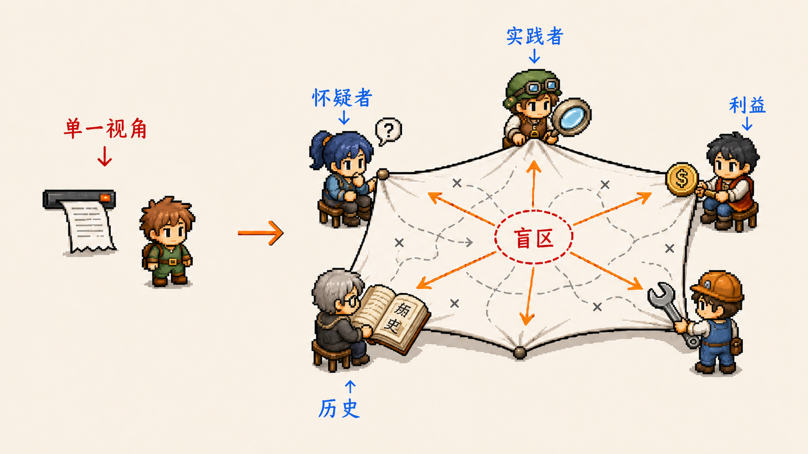

# Roundtable Skill

中文 | [English](README.md)

[](https://github.com/rawpaper123/Roundtable-skill/stargazers)
[](https://github.com/rawpaper123/Roundtable-skill/actions/workflows/docs.yml)
[](LICENSE)
[](https://github.com/LingTai-AI/lingtai)
[](docs/EXECUTOR_SETUP.md)
[](skills/codex/roundtable-skill/SKILL.md)

Roundtable Skill 的意思就是“圆桌会议”。

它把一个原本由单个 AI 完成的任务，变成一场有主持人、有专家、有交叉审查的圆桌讨论。执行者先根据任务内容，为不同 Lingtai Agent 临时分配专家身份；专家从各自角度审查计划、证据和执行进展；最后由执行者综合意见、做出取舍，并负责交付结果。

适合那些“一个模型自己想、自己审、自己交付”不够稳的任务：代码合并、研究简报、商业计划、产品决策、日常重大选择，或者任何需要多角度审查的复杂问题。


**第一次使用？先看 [Quickstart](QUICKSTART.md) 的 60 秒适配判断。**

## 它解决什么问题

单个 AI 很容易给出听起来顺畅、但视角单一的答案。

Roundtable 做的事情很简单：把不同视角放到同一张桌上。实践者会指出一线经验里真正麻烦的地方，怀疑者会追问最强反例，安全审查者会盯住权限和泄露风险，财务视角会看激励和成本，历史视角会提醒你这类问题以前怎么失败过。

这些专家身份不是固定人设。每次任务开始时重新分配，任务结束后就收回。下次任务换一组更合适的视角。


重点不是“Agent 越多越好”，而是让真正互补的角色之间产生张力。不同视角一起拉扯同一个问题，薄弱假设、缺失证据和下一步行动才会浮出来。



## 核心能力

- 🪑 **圆桌审查**：让多个 Lingtai Agent 按任务临时扮演不同专家。
- 🔍 **发现盲区**：让专家审查初始计划、证据和执行过程，而不只是附和。
- ⚖️ **整理冲突**：把互相矛盾的判断、证据强弱和关键问题摊开。
- ✅ **保留负责人**：执行者仍然负责最终取舍、验证、提交和回滚。
- 🧯 **处理沉默 Agent**：不无限等待；记录问题，做一次安全修复，然后继续推进。

## 技术栈

- Markdown 文档和提示词模板
- Codex Skill 包：`skills/codex/roundtable-skill`
- PowerShell / Bash 安装与检查脚本
- Lingtai 作为外部 Agent 运行时
- GitHub Actions 文档校验

这个仓库不内置 Lingtai。没有配置 Lingtai 时，它只是文档和模板，不能假装已经运行了真实专家组。

## 快速开始

用一个命令先拿到 Roundtable 包，并自动选择合适的执行者路径。检测到 Codex 时，会安装原生 Codex Skill；其他 coding agent 则使用同一套 Roundtable 协议提示词和 Lingtai 检查流程。

```powershell
$rt = Join-Path $env:TEMP "Roundtable-skill"; Remove-Item -Recurse -Force $rt -ErrorAction SilentlyContinue; git clone --depth 1 https://github.com/rawpaper123/Roundtable-skill.git $rt; & "$rt\scripts\install-roundtable.ps1"
```

```bash
tmp="$(mktemp -d)" && git clone --depth 1 https://github.com/rawpaper123/Roundtable-skill.git "$tmp/Roundtable-skill" && "$tmp/Roundtable-skill/scripts/install-roundtable.sh"
```

然后在目标项目里配置 Lingtai，并检查是否可以运行：

```powershell
.\scripts\check-roundtable.ps1 -RequireLingtai
```

```bash
./scripts/check-roundtable.sh --require-lingtai
```

如果检查结果是 `docs_only`，说明还不能运行真实圆桌。先配置 Lingtai 和至少一个 Agent，不要伪造专家回复。

目前不同 coding agent 没有统一的原生 Skill 标准，所以这里不会假装“所有终端都能装同一种原生 Skill”。Roundtable 提供的是：Codex 原生安装器，加上一套执行终端中立的协议提示词。Claude Code、Cursor、Windsurf、Kimi Work 或其他 agent 都可以按这套协议运行。关键不是 Codex，而是：有一个负责最终交付的执行者，并且至少有一个可触达的 Lingtai Agent。

完整说明：

- [Quickstart](QUICKSTART.md)
- [Lingtai 设置](docs/LINGTAI_SETUP.md)
- [安装路径对照](docs/INSTALL_MATRIX.md)
- [首次运行检查](docs/FIRST_RUN_CHECKLIST.md)
- [问题排查](docs/TROUBLESHOOTING.md)

## 使用场景

### 开发任务

```text
为这个发布关卡开启 Roundtable。

角色：
- 发布可靠性审查者
- 安全与隐私审查者
- 范围控制审查者

目标：
判断这个权限相关 PR 是否可以合并。
```

### 研究任务

```text
为这个研究问题开启 Roundtable。

角色：
- 实践者
- 学者
- 怀疑者
- 经济学家
- 历史学家

每个角色给出：
1. 两句话核心立场
2. 最强证据
3. 只有这个视角才会提醒我的那件事

最后产出：
- 矛盾地图
- 按可靠性排序的关键发现
- 隐藏关联
- 行动建议
- 一个能改变结论的前沿问题
```

### 日常决策

```text
为这个个人选择开启 Roundtable。

角色：
- 现实朋友
- 预算审查者
- 风险审查者
- 时间规划者
- 反对者

目标：
选出一个下个月真的能执行的方案，而不是听起来最漂亮的方案。
```

### 商业计划

```text
为这个商业计划开启 Roundtable。

角色：
- 客户视角
- 运营视角
- 财务视角
- 增长视角
- 法务与风险视角

目标：
在花钱之前，找出最可能让这个计划失败的假设。
```

更多示例见 [Use cases](docs/USE_CASES.md)、[Showcase](docs/SHOWCASE.md)、[Demo script](docs/DEMO_SCRIPT.md)。

## 基本流程

1. 执行者先看清任务和现有证据。
2. 执行者给可用的 Lingtai Agent 分配临时专家角色。
3. 专家回复必须修复的问题、风险，或者明确说“从我的角度看没有其他意见”。
4. 执行者整理分歧，决定采纳什么、拒绝什么。
5. 执行者完成实际交付，或者产出最终简报。
6. 执行者报告证据、验证结果、剩余风险；如果涉及代码，还要说明回滚方式。

## 适合第一次尝试的任务

先用低风险但真实的任务试：

- 合并前审查一个小 PR
- 压测一份研究总结
- 审查一份发布清单
- 批判一份商业计划
- 比较两个产品方向

第一次不要拿生产数据删除、密钥操作、不可逆迁移、高风险业务决策来试。

## 重要链接

- [为什么需要 Roundtable](docs/WHY_ROUNDTABLE.md)
- [和普通提示词的区别](docs/COMPARISON.md)
- [Agent 阵容指南](docs/AGENT_ROSTER_GUIDE.md)
- [执行者设置](docs/EXECUTOR_SETUP.md)
- [安全说明](SECURITY.md)
- [贡献指南](CONTRIBUTING.md)
- [更新记录](CHANGELOG.md)

需要帮助可以去 [Discussions](https://github.com/rawpaper123/Roundtable-skill/discussions/1)，也可以提交 [setup help issue](https://github.com/rawpaper123/Roundtable-skill/issues/new?template=setup_help.md)。

## 参与贡献

好的贡献应该让 Roundtable 更容易被真实项目使用：更清楚的安装路径、更稳定的执行者适配、更安全的示例、更锋利的使用场景提示词。可以先看 [贡献指南](CONTRIBUTING.md)，也可以直接提交一个具体的 first-run 问题。

## 安全边界

不要提交：

- `.lingtai/`
- `.recipe/`
- mailbox 文件
- OAuth token
- `codex-auth.json`
- 私钥
- 日志
- 项目密钥
- 运行时数据

## License

MIT
